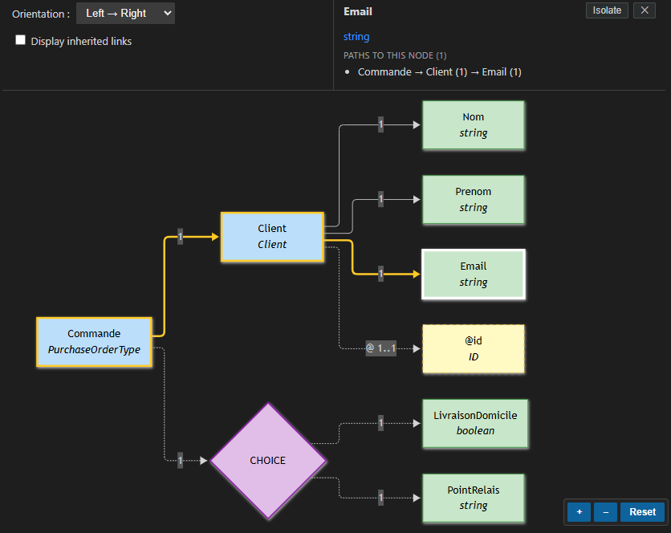

# XSD Viewer & Visualizer for VS Code

**XSD Viewer** is a Visual Studio Code extension designed to visualize XSD file structures using Mermaid diagrams. It adds a dedicated view for all `.xsd` format files.

It simplifies the understanding of complex XSD schemas by converting verbose XML code into a clear visual graph.

---

## Overview

<p align="center">
  
</p>

> *Real-time graphical visualization of an XSD file featuring type hierarchies, cardinalities, and stereotypes.*

---

## Key Features

- **Real-time Diagram Visualization**: Instantly view the hierarchical structure of your XSD schemas.
- **Inheritance Support**: Clear visualization of type extensions and restrictions (`xs:extension`, `xs:restriction`).
- **Element Isolation**: Isolate a specific node to focus on its interactions with parent and child elements.
- **Reference Paths**: Full visibility into the paths leading to the selected node.

---

## Supported XSD Elements

The extension parses and visually represents the following XSD components:

| XSD Element | Visual Representation | Description / Style |
| :--- | :--- | :--- |
| **`xs:element` (Complex)** | Blue node (`fill:#bbdefb`) | Structural elements with child elements. |
| **`xs:element` (Simple)** | Green node (`fill:#c8e6c9`) | Leaf elements (simple/primitive types). |
| **`xs:attribute`** | Yellow dashed node (`fill:#fff9c4`) | Attributes attached to a complex type. |
| **`xs:choice`** | Purple node (`fill:#e1bee7`) | Exclusive choice blocks (`«choice»`). |
| **`xs:complexType` (Abstract)** | Orange dashed node (`fill:#ffe0b2`) | Abstract base types (`«abstract»`). |
| **`xs:group`** | Cyan node (`fill:#b2ebf2`) | Reusable element groups (`«group»`). |

---

## Usage Example

Here is a simple example of an XSD file:

```xml
<?xml version="1.0" encoding="UTF-8"?>
<xs:schema xmlns:xs="[http://www.w3.org/2001/XMLSchema](http://www.w3.org/2001/XMLSchema)">

  <!-- Root Element -->
  <xs:element name="Commande" type="PurchaseOrderType"/>

  <!-- Abstract Complex Type -->
  <xs:complexType name="Personne" abstract="true">
    <xs:sequence>
      <xs:element name="Nom" type="xs:string"/>
      <xs:element name="Prenom" type="xs:string"/>
    </xs:sequence>
  </xs:complexType>

  <!-- Extended Complex Type -->
  <xs:complexType name="Client">
    <xs:complexContent>
      <xs:extension base="Personne">
        <xs:sequence>
          <xs:element name="Email" type="xs:string"/>
        </xs:sequence>
        <xs:attribute name="id" type="xs:ID" use="required"/>
      </xs:extension>
    </xs:complexContent>
  </xs:complexType>

  <!-- Main Complex Type -->
  <xs:complexType name="PurchaseOrderType">
    <xs:sequence>
      <xs:element name="Client" type="Client"/>
      <xs:choice>
        <xs:element name="LivraisonDomicile" type="xs:boolean"/>
        <xs:element name="PointRelais" type="xs:string"/>
      </xs:choice>
    </xs:sequence>
  </xs:complexType>
</xs:schema>
```